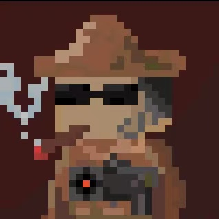

# The Werewolf Game

## Youtube Demo
[Click Here](https://www.youtube.com/watch?v=RUlb3AJOruQ)

## Introduction

For the high popularity of the game industry possesses, there are so many different types of games born with the cheering of people. For example, Casual games makes people have fun in leisure time; Sport games makes the player feel excited. Now there is a kind of game is becoming the mainstream ---- the Reasoning games. This is a kind of game that people can try their best to realize the potential of their brain. Everyone is possible to become Sherlock Holmes.

It is designed to have 5 players in a game. Because once the number of players is insufficient, the game could not begin. That is critical question of this kind of game. Therefore we try our best to make a game with the least player.

## How to play?

There are two identities—Civil and Killer. Civil has three roles—Police, Banner and  Doctor. Killer has two roles—Killer and Spy. Each of them has a unique positioning. The game will happened in two states, one is Nighttime. Players can use their own skills to protect or kill someone, the skills have priority, the sequence of skills of roles is: Banner, Doctor, Police, Killer, Spy. The other is daytime, players take turns to give some opinions. If the number of Killer is larger than the number of Civil, Killer win. If all of the Killer is voted or killed, Civil win.

## How to run the game?

```bash
python Game.py
```

## Characters

### Police


Police’s skill is that he can ask a character’s identity in each round. There will have two identities -- good(Civil) or bad(Killer). Killer and Banner(although he is Civil) will be bad, Spy(althought he is Killer) and Doctor will be good.

### Doctor


Doctor can inject a character each round. If the character has only one injection, in that case, killer’s skill will be useless for that character and the injection of that person will be erase. If a character has two injections, that character will be dead at that night.

### Banner


Banner can disable a particular character's operation. Banner can be a key of winning the game.

### Killer


As a killer, he can kill a character within a round. But must be careful, you may kill your teammate for the completely unknown status.

### Spy



Spy is also in the team of Crime. Specially, when a police check his title, spy can disguise as a Civil. He also don't know who is his teammate, so be careful.

## Programming

### Languages

Werewolf the game, is developed under **Python**, no more dependencies is needed, not critical necessary of which particular Python version.

### OOP

* Characters Class
* Player Class
* Game Class

Characters describe the 5 different characters as mentioned before, Player interconnect a player with a character, Game is for controlling the game process.

### Algorithms

**Needle Counting**: If a character has 1 injection, it will be initialized when a Killer operate on him. Otherwise, the injection will always with him, If that character get another injection by the Doctor, he will die by position of drug. 

**Identity Asking**: Due to spy can disguise his identity, so he can slip away unpunished. In the meanwhile, a banner will be misjudged by the police for the balance of the game.

## Software Development Plan

### Schedules and Members

We discuss what type we would do in the first week. It is according to the mainstream. After discussion, we choose reasoning game. While there are so many reasoning game in the market, we must do something special. In that case, the game that we design can has advantage to compete with other games. Then the second week and third week, Steve’s responsibility is coding and game developing, Alston is responsible for drawing the illustration of each roles and interface. Accounting to the plan, King should write the report.

## Future Update Plan

Now we just have a simple version, it can support to base rules to play the game. In the future, we may add some new roles, new function, new rules. Killing Game has a lot of place to improve, so we will try our best to improve it, let it be a perfect game. We hope that there will be one day, Killing Game will be the game which is proverbial.

* Adding GUI
* Adding Online support

