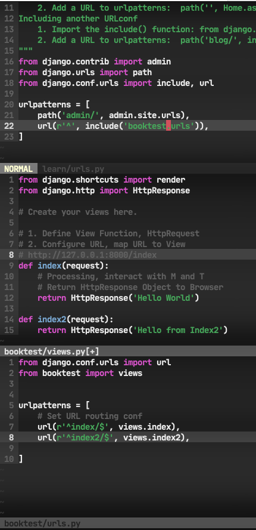

# Django Learning Note

M - Model     -> Model
T - Template  -> View
V - View      -> Controller

## Django Project Structure

```bash
└── learn
    ├── booktest
    │   ├── __init__.py
    │   ├── __pycache__
    │   │   ├── __init__.cpython-38.pyc
    │   │   ├── admin.cpython-38.pyc
    │   │   └── models.cpython-38.pyc
    │   ├── admin.py
    │   ├── apps.py
    │   ├── migrations
    │   │   ├── 0001_initial.py
    │   │   ├── 0002_auto_20210114_1139.py
    │   │   ├── __init__.py
    │   │   └── __pycache__
    │   │       ├── 0001_initial.cpython-38.pyc
    │   │       ├── 0002_auto_20210114_1139.cpython-38.pyc
    │   │       └── __init__.cpython-38.pyc
    │   ├── models.py
    │   ├── tests.py
    │   └── views.py
    ├── db.sqlite3
    ├── learn
    │   ├── __init__.py
    │   ├── __pycache__
    │   │   ├── __init__.cpython-38.pyc
    │   │   ├── settings.cpython-38.pyc
    │   │   ├── urls.cpython-38.pyc
    │   │   └── wsgi.cpython-38.pyc
    │   ├── asgi.py
    │   ├── settings.py
    │   ├── urls.py
    │   └── wsgi.py
    └── manage.py
```

## Start Apps

```bash
python manage.py startapps booktest
```

Then the booktest folder and its structure will be generated automatically
You may modify `learn/learn/settings.py` to add the new apps


## Model

### Creating Tables

add Class in booktest/models.py

```python
class BookInfo(models.Model):
    '''
    ORM Class
    Book Model Class
    Must Inheritent models.Model
    '''
    bTitle = models.CharField(max_length=20)  # CharField 字符串
    bPub_date = models.DateField()            # DateField 日期
    

# 1 to * mapping from BookInfo to Character
class Character(models.Model):
    '''
    ORM Class
    Character Model Class
    Must Inheritent models.Model
    Implementing Relational Database
    '''
    hName = models.CharField(max_length=20)
    hGender = models.BooleanField(default=False)  # BooleanField 布尔值
    hComment = models.CharField(max_length=128)
    hBook = models.ForeignKey('BookInfo', on_delete=models.CASCADE) # ForeignKey to BookInfo.id
```

### Migrates classes

```bash
python manage.py makemigrations
python manage.py migrate
```

### Starting a shell

```bash
python manage.py shell
```

### Adding an record to DB

in Shell

```python
from booktest.models import BookInfo, Character
from datetime import date
b = BookInfo()
b.bTitle = 'Title'
b.bPub_date = date(2000, 1, 1)
b.save()

# Using Foreign Key
h = Character()
h.hName = 'Name'
h.hBook = b    # FK to book_id
```

### Getting models in shell

in Shell

```python
from booktest.models import BookInfo, Character
b = BookInfo.objects.get(id=1)
b_all = BookInfo.objects.all()
```

### Admin

1. Set Language Code and Time zone in `settings.py`

2. Create Manager

```bash
python manage.py createsuperuser
```

3. Register Model Class

Modify `admin.py`

```python
from booktest.models import BookInfo
admin.site.register(BookInfo)
```

### Customize Admin Page

Customize Model Admin Class in `admin.py`

```python
class BookInfoAdmin(admin.ModelAdmin):
	'''
	BookInfo Model Admin Class
	'''
	list_display = ['id', 'bTitle', 'bPub_date']


admin.site.register(BookInfo, BookInfoAdmin)
	

```

### Manager Model Object

```python
In [2]: type(BookInfo.objects)
Out[2]: django.db.models.manager.Manager
```

### Overwriting BookInfoManager

```python
class BookInfoManager(models.Manager):
	def all(self):
		books.super().all()
		books = books.filter(isDelete=False)
		return books

class BookInfo(models.Model):
	+----lines----+

	objects = BookInfoManager()

	@classmethod
	def create_book(cls, bTitle, bPub_date):
		obj = cls()
		obj.bTitle = bTitle
		obj.bPub_date = bPub_date
		obj.save()
		return obj
```

## View

Modify `views.py`

### Add a View 

```python
from django.http import HttpResponse

# http://127.0.0.1:8000/index
def index(request):
  # Processing, interact with M and T
  
  # Return HttpResponse Object to Browser
  return HttpResponse('Hello World')
```

### URLs redirect



1. All URL config are defined in `urlpatterns` list
2. `url()` has two parameters, one is regex, the other is process action or `include()` views name
3. re with URL String, if success then execute following action or re with subviews' `urlpatter` 

## Template

Template file is not only html, there can be variables and even functions

### Create

1. Creating Templates folder

2. Register Template folder in `settings.py`

   ```python
   TEMPLATES = [
     {
       'DIRS': [os.path.join(BASE_DIR, 'templates')],
     }
   ]
   ```

3. Create HTML template in `Templates/booktest`

### Return Template in View

In `booktest/views.py`. We define Template DIR in `settings.py`, so that in `loader.get_template` just appends subdirectories is OK.

```python
def index(request):
  temp = loader.get_template('booktest/index.html')
  context = {}
  res_html = temp.render(context, request)
  return HttpResponse(res_html)
```

With passing parameters

```python
def detail(request, bid):
  book = BookInfo.objects.get(id=bid)
  heros = book.character_set.all()
  return render(request, 'booktest/detail.html', {'book': book, 'heros': heros})
```

**Do not Forget to register in urls.py**

| Packages or Templates | Modify                                                       |
| --------------------- | ------------------------------------------------------------ |
| `view.py`             | `def`, prepare variables, `return render()`                  |
| `appname/urls.py`     | In `urlpatterns` add `url(r'^books/(\d+)$', views.detail)` where `(\d+)` is for passing parameters in `view.detail(request, bid)` |
| `template.html`       | Passing `variables` or using `` |
|                       |                                                              |

